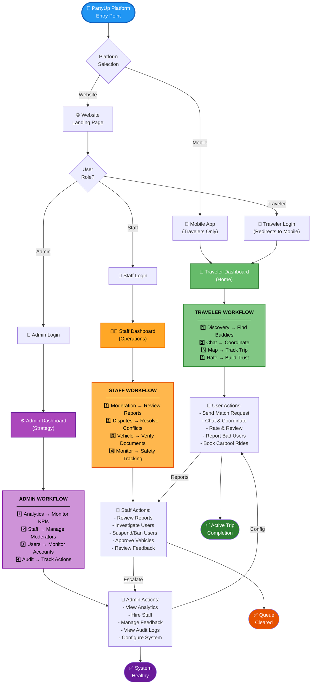
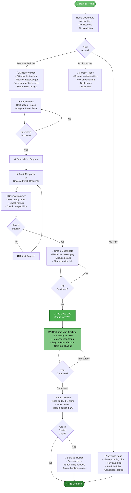
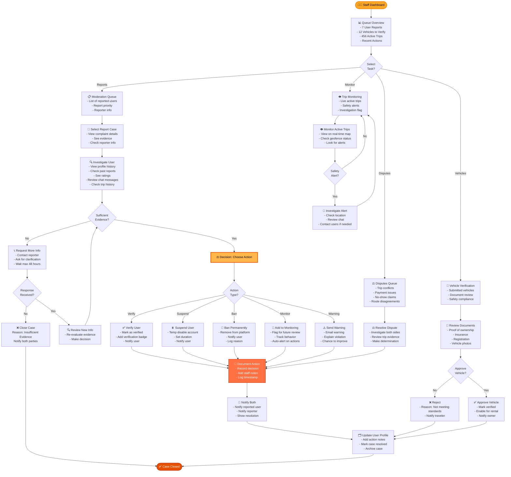
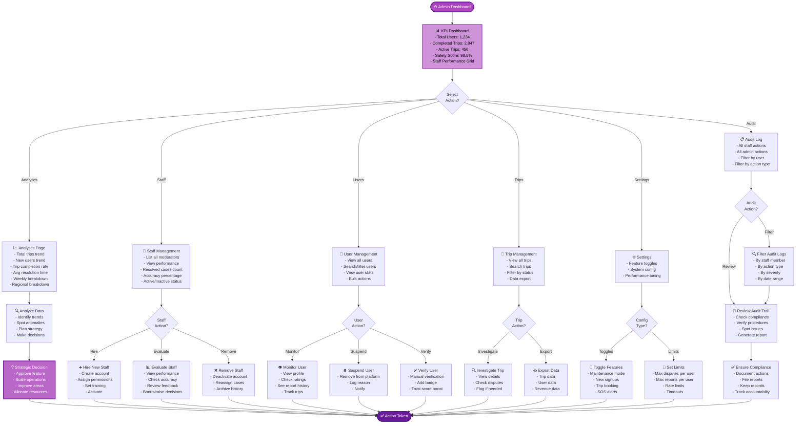
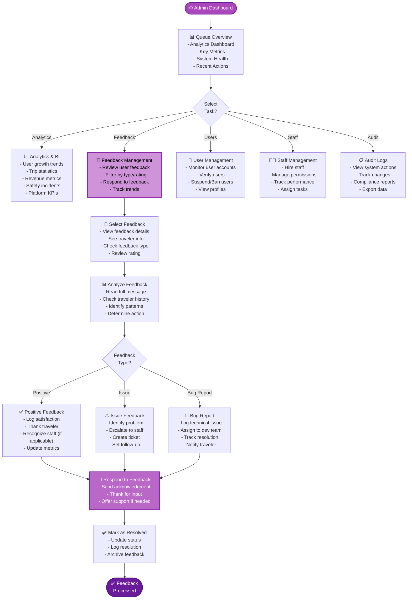
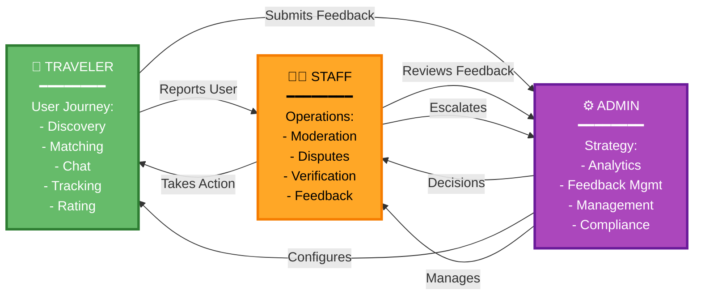
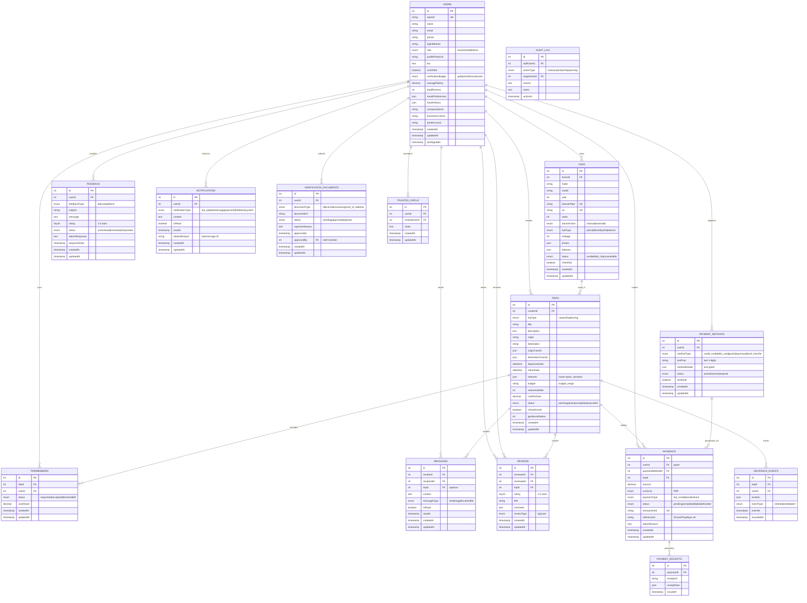

# PartyUp Complete System Flowchart

## 🎯 Overview: 3-Tier RBAC Platform with Swimlanes

This diagram shows the complete PartyUp system with all three user roles (Travelers, Staff, Admin) operating in parallel, with cross-functional interactions.

---

## 📊 UPDATED USE CASE DIAGRAM (All Features)

```mermaid
flowchart TB
 subgraph TravelerUseCases["<br>"]
        T1["Register & Login"]
        T2["Create Profile"]
        T3["Discovery"]
        T4["My Trips"]
        T5["Chat"]
        T6["Map Tracking"]
        T8["Carpooling"]
        T9["Touring"]
        T10["Manage Vehicles"]
        T11["Trusted Circle"]
        T12["View Home Dashboard"]
        T13["Settings"]
        T14["Payment History"]
        T15["Report/Feedback/Ratings"]
  end
 subgraph StaffUseCases["<br>"]
        S1["Staff Dashboard"]
        S2["Moderation Queue"]
        S3["Disputes Report"]
        S4["Verify Vehicles"]
        S5["Trip Monitoring"]
        S6["Feedback Review"]
        S7["Payment Monitoring"]
        S8["Pairing History"]
  end
 subgraph AdminUseCases["<br>"]
        A1["Dashboard - View KPIs"]
        A2["Analytics"]
        A3["Feedback Management"]
        A4["Staff Management"]
        A5["User Management"]
        A6["Trip Management"]
        A7["Reports"]
        A8["Settings - System Config"]
        A9["Audit Log"]
        A10["Payment Management"]
        A11["Pairing History"]
  end
    Traveler["👤 Traveler/User"] --> T1 & T2 & T3 & T4 & T5 & T6 & T8 & T9 & T10 & T11 & T12 & T13 & T14 & T15
    Staff["👨‍💼 Staff/Moderator"] --> S1 & S2 & S3 & S4 & S5 & S6 & S7 & S8
    Admin["⚙️ Admin"] --> A1 & A2 & A3 & A4 & A5 & A6 & A7 & A8 & A9 & A10 & A11

    style Traveler fill:#4F46E5,color:#fff
    style Staff fill:#F59E0B,color:#fff
    style Admin fill:#EF4444,color:#fff
    style TravelerUseCases fill:#E0E7FF
    style StaffUseCases fill:#FEF3C7
    style AdminUseCases fill:#FEE2E2
```



---

## 📊 MAIN SYSTEM FLOWCHART (Swimlane View)



---

## 👤 DETAILED TRAVELER FLOW (User Journey)



---

## 👨‍💼 DETAILED STAFF FLOW (Moderation & Operations)



---

## ⚙️ DETAILED ADMIN FLOW (Platform Management & Strategy)



---

## ⚙️ DETAILED ADMIN FLOW (Management & Oversight)



---

## 🔄 CROSS-FUNCTIONAL INTERACTIONS



---

## 💡 IMPROVEMENTS TO YOUR SYSTEM

### **Current Strengths:**
✅ Clear 3-tier RBAC separation  
✅ Well-defined user workflows  
✅ Comprehensive moderation system  
✅ Audit logging for compliance  
✅ Real-time safety features (GPS, geofencing)  
✅ Feedback management for admin oversight

### **Suggested Optimizations:**

#### **1. Enhanced Flow Structure**
**Current:** Linear entry → separate roles  
**Better:** Add a role-agnostic landing with clear navigation

```
PartyUp Entry
├── For New Users: Sign Up → Role Selection
├── For Existing Users: Login → Dashboard  
└── For Staff/Admin: Direct Login → Dashboard
```

#### **2. Faster Traveler Journey**
**Current:** Discovery → Request → Chat → Confirm  
**Suggestion:** Add "One-Click Booking" for frequent travelers

```
One-Click Re-Book Path:
- Previous buddy saved?
- Yes → Auto-create trip with same buddy
- Notification to buddy
- Instant coordination
```

#### **3. Staff Queue Prioritization**
**Current:** All reports equal weight  
**Suggestion:** Add severity levels to prioritize critical cases

```
Priority Levels:
- 🔴 CRITICAL: Safety violation (GPS tampering, threats)
- 🟠 HIGH: Ban-worthy violation (fraud, abuse)
- 🟡 MEDIUM: Suspension-worthy (policy violation)
- 🟢 LOW: Warning-worthy (minor issues)
```

#### **4. Automated Admin Alerts**
**Current:** Admin manually checks analytics  
**Suggestion:** Add threshold-based auto-alerts

```
Auto-Triggers:
- Safety score drops below 95% → Alert admin
- Staff queue > 50 items → Auto-page staff
- Trip cancellation rate > 10% → Flag trend
- New user fraud pattern detected → Escalate
```

#### **5. Traveler-Staff Communication Portal**
**Current:** Asynchronous report handling  
**Suggestion:** Add direct escalation path

```
Escalation Path:
Traveler can → Request live staff support
Staff dashboard shows → Real-time escalation queue
Traveler can → Chat with staff about dispute
```

#### **6. Batch Operations for Admin**
**Current:** Single user actions  
**Suggestion:** Add bulk management

```
Batch Actions:
- Bulk suspend users (by region, by report type)
- Export data (trips, users, revenue)
- Send mass notifications
- Schedule maintenance window
```

---

## 🎯 Implementation Priority

**Phase 1 (MVP):** ✅ Already built
- All 3 roles with basic flows
- Role separation & routing
- Queue systems for staff

**Phase 2 (Enhance - Next Steps):**
- 🔴 Priority levels for staff queue
- 🟠 One-click re-booking for travelers
- 🟡 Automated admin alerts

**Phase 3 (Scale):**
- 🟢 Traveler-staff escalation portal
- 🔵 Batch operations for admin
- 🟣 Advanced analytics dashboard

---

## 📋 Quick Reference: All Flows at a Glance

| Role | Entry | Main Actions | Output | Next |
|------|-------|--------------|--------|------|
| **👤 Traveler** | Mobile/Web | Discovery → Match → Chat → Rate | Active Trip | Trusted Circle |
| **👨‍💼 Staff** | Web Login | Dashboard → Queue → Investigate → Act | Case Closed | Audit Trail |
| **⚙️ Admin** | Web Login | Dashboard → Analytics → Decide → Config | Action Taken | Compliance |

---

## 🎨 Color Coding Reference

- 🟢 **Green (#66bb6a):** Traveler/User role
- 🟠 **Orange (#ffa726):** Staff/Operations role  
- 🟣 **Purple (#ab47bc):** Admin/Strategy role
- 🔵 **Blue (#2196f3):** Platform/System entry
- 🟡 **Yellow (#ffb74d):** Active/In-progress states
- 🔴 **Red (warning colors):** Critical actions (ban, suspend, escalate)
- ⚫ **Dark:** Final/completed states

---

## 📐 DATABASE ENTITY RELATIONSHIP DIAGRAM (ERD)



---

## 📊 Database Schema Notes

### **Key Features Implemented:**

#### **1. Trip Types (Carpooling + Touring)**
- `TRIPS.tripType`: Distinguishes between carpooling rides and touring adventures
- Both share same entity but have different properties/behaviors
- Carpooling: shorter rides, shared costs, focused on transportation with driver vehicle
- Touring: longer trips, shared experiences, activities-based group travel

#### **2. Carpooling Vehicles**
- `CARS`: Only for carpooling context (driver's vehicle)
- Fields: make, model, year, seats, transmission, fuel type, license plate, VIN
- Status: available | in_trip | unavailable
- Linked to trips, not a separate rental marketplace
- Driver (creator) can use their car for carpooling trips

#### **3. Payment System**
- `PAYMENT_METHODS`: Stores user payment methods (GCash, PayMaya, cards, bank transfer)
- `PAYMENTS`: Records all transactions with status tracking (trip payments only)
- `PAYMENT_RECEIPTS`: Generates receipts for compliance
- Supports trip cost payments, deposits, and refunds
- Integration with Stripe and local payment providers

#### **4. Trip Members & Cost Sharing**
- `TRIPMEMBERS`: Tracks trip participants and their cost shares
- Statuses: requested | accepted | declined | left
- `costShare`: Each member's portion of trip costs

#### **5. Feedback Management**
- `FEEDBACK`: User feedback about trips/cars/platform
- Separate from reviews (peer ratings)
- Tracks feedback type (trip/car/platform), status (unreviewed/reviewed/responded)
- Admin can respond to feedback and track follow-up

#### **6. Verification System**
- `VERIFICATION_DOCUMENTS`: Document upload and verification workflow
- Staff can approve/reject with reasons
- Tracks verification badge awards
- Document types: id | license | insurance | proof_of_address

#### **7. Trust & Safety**
- `GEOFENCE_EVENTS`: Real-time location tracking for active trips
- `TRUSTED_CIRCLE`: Users can save trusted travel buddies
- `AUDIT_LOG`: Staff actions logged for compliance

#### **8. Communication**
- `MESSAGES`: Trip context only (no booking messages)
- Can handle text, images, locations, files
- Read/unread status tracking

#### **9. Reviews vs Feedback**
- `REVIEWS`: User-to-user ratings after trips (1-5 stars) - trip & user types only
- `FEEDBACK`: User feedback about platform/features/cars (separate system for admin)

### **Foreign Key Relationships:**
- Users are the central hub connecting to all domains
- Trips are the main entity (carpooling or touring)
- Cars are optional for trips (only used in carpooling trips)
- Payments connect to trips for cost tracking
- Messages are contextual to trips only
- Reviews are tied to trips and reviewees

### **Removed Entities:**
- ❌ BOOKINGS (car rental bookings)
- ❌ Rental marketplace features
- ❌ Booking-related payment types

### **Enums Used:**
- `tripType`: carpooling | touring
- `role`: traveler | staff | admin
- `status`: planning | active | completed | cancelled (trips)
- `methodType`: credit_card | debit_card | gcash | paymaya | bank_transfer
- `paymentType`: trip_cost | deposit | refund
- `feedbackType`: trip | car | platform
- `notificationType`: trip_update | message | payment | feedback | system

---
