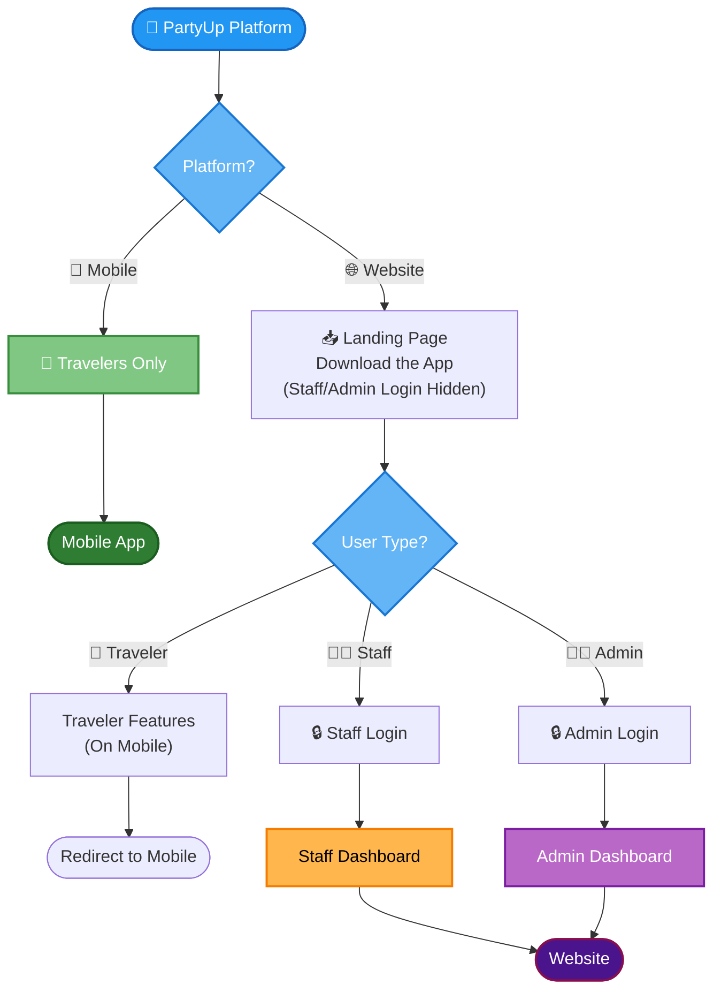

# PartyUp Platform - Entry Point Diagram

## Entry Flow Structure

**Platform Detection:**
1. User enters PartyUp
2. Choose platform: Mobile or Website

**Mobile Path:**
- Direct to Travelers only
- No role selection needed

**Website Path:**
- Ask for User's Role
- Route to Staff Dashboard (moderators)
- Route to Admin Dashboard (system managers)

---

## Quick Reference
- **Mobile:** Travelers → Mobile App
- **Website:** Staff → Staff Dashboard Website
- **Website:** Admin → Admin Dashboard Website
